# 1 CAPA


```python
%run -i create_iris_data.py
%run -i circuito_v2.py
%run -i multiclass_clf.py

qubits = 4
batch_size=16
epochs=250
learning_rate = 0.05
kernel_fn = kernel_v2
```


```python
layers = 1
```

## CLASE 0 VS CLASE 1


```python
opt_1Layer_01=optimization(learning_rate, epochs, batch_size,qubits,layers,
                           kernel_fn,params=create_params_k2(qubits=qubits, layers=layers),
                           X=X_train_01,Y=Y_train_01, plot_kta = True, title="Clase 0 vs clase 1")
```

    Layer(s) = 1 ---- Epochs = 10 ---- Train KTA = 0.54118204
    Layer(s) = 1 ---- Epochs = 20 ---- Train KTA = 0.55613929
    Layer(s) = 1 ---- Epochs = 30 ---- Train KTA = 0.57098931
    Layer(s) = 1 ---- Epochs = 40 ---- Train KTA = 0.58218217
    Layer(s) = 1 ---- Epochs = 50 ---- Train KTA = 0.59615481
    Layer(s) = 1 ---- Epochs = 60 ---- Train KTA = 0.60541320
    Layer(s) = 1 ---- Epochs = 70 ---- Train KTA = 0.61714166
    Layer(s) = 1 ---- Epochs = 80 ---- Train KTA = 0.62809485
    Layer(s) = 1 ---- Epochs = 90 ---- Train KTA = 0.63844204
    Layer(s) = 1 ---- Epochs = 100 ---- Train KTA = 0.64670384
    Layer(s) = 1 ---- Epochs = 110 ---- Train KTA = 0.65377784
    Layer(s) = 1 ---- Epochs = 120 ---- Train KTA = 0.65830833
    Layer(s) = 1 ---- Epochs = 130 ---- Train KTA = 0.65821517
    Layer(s) = 1 ---- Epochs = 140 ---- Train KTA = 0.66291672
    Layer(s) = 1 ---- Epochs = 150 ---- Train KTA = 0.66476524
    Layer(s) = 1 ---- Epochs = 160 ---- Train KTA = 0.66512352
    Layer(s) = 1 ---- Epochs = 170 ---- Train KTA = 0.66584158
    Layer(s) = 1 ---- Epochs = 180 ---- Train KTA = 0.66784602
    Layer(s) = 1 ---- Epochs = 190 ---- Train KTA = 0.67017466
    Layer(s) = 1 ---- Epochs = 200 ---- Train KTA = 0.67480081
    Layer(s) = 1 ---- Epochs = 210 ---- Train KTA = 0.67652458
    Layer(s) = 1 ---- Epochs = 220 ---- Train KTA = 0.67576188
    Layer(s) = 1 ---- Epochs = 230 ---- Train KTA = 0.68007380
    Layer(s) = 1 ---- Epochs = 240 ---- Train KTA = 0.68558812
    Layer(s) = 1 ---- Epochs = 250 ---- Train KTA = 0.68008888
    


    
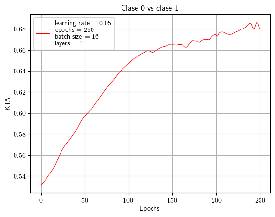
    


```python
opt_1Layer_01
```


    {'params_init': tensor([[-0.2475,  1.8379,  1.2832, -0.5739]], grad_fn=<CloneBackward0>),
     'params_opt': tensor([[-1.3482,  0.3438,  0.0083,  6.9057]], requires_grad=True),
     'latest_kta': tensor(0.6801, grad_fn=<DivBackward0>)}


```python
svc_1Layer_01 = SVM_classifier(qubits, layers,opt_1Layer_01["params_opt"].detach(),
                               kernel_fn,X_train_01,X_test_01, Y_train_01,Y_test_01)
print(f'Optimization results:\n {opt_1Layer_01} \nSVC results: {svc_1Layer_01}')
```

    Optimization results:
     {'params_init': tensor([[-0.2475,  1.8379,  1.2832, -0.5739]], grad_fn=<CloneBackward0>), 'params_opt': tensor([[-1.3482,  0.3438,  0.0083,  6.9057]], requires_grad=True), 'latest_kta': tensor(0.6801, grad_fn=<DivBackward0>)} 
    SVC results: {'Clf': SVC(kernel=<function SVM_classifier.<locals>.<lambda> at 0x000001E6945F1580>), 'test_accuracy': 1.0}
    

## Clase 1 vs clase 2


```python
opt_1Layer_12=optimization(learning_rate, epochs, batch_size,qubits,layers,
                           kernel_fn,params=create_params_k2(qubits=qubits, layers=layers),
                           X=X_train_12,Y=Y_train_12, plot_kta = True, title="Clase 1 vs clase 2")
```

    Layer(s) = 1 ---- Epochs = 10 ---- Train KTA = 0.66843766
    Layer(s) = 1 ---- Epochs = 20 ---- Train KTA = 0.67649359
    Layer(s) = 1 ---- Epochs = 30 ---- Train KTA = 0.68405986
    Layer(s) = 1 ---- Epochs = 40 ---- Train KTA = 0.69126791
    Layer(s) = 1 ---- Epochs = 50 ---- Train KTA = 0.69589633
    Layer(s) = 1 ---- Epochs = 60 ---- Train KTA = 0.69897205
    Layer(s) = 1 ---- Epochs = 70 ---- Train KTA = 0.70067680
    Layer(s) = 1 ---- Epochs = 80 ---- Train KTA = 0.69904178
    Layer(s) = 1 ---- Epochs = 90 ---- Train KTA = 0.69705254
    Layer(s) = 1 ---- Epochs = 100 ---- Train KTA = 0.69860089
    Layer(s) = 1 ---- Epochs = 110 ---- Train KTA = 0.69992232
    Layer(s) = 1 ---- Epochs = 120 ---- Train KTA = 0.70047557
    Layer(s) = 1 ---- Epochs = 130 ---- Train KTA = 0.69987106
    Layer(s) = 1 ---- Epochs = 140 ---- Train KTA = 0.69868523
    Layer(s) = 1 ---- Epochs = 150 ---- Train KTA = 0.69919878
    Layer(s) = 1 ---- Epochs = 160 ---- Train KTA = 0.69920927
    Layer(s) = 1 ---- Epochs = 170 ---- Train KTA = 0.70032692
    Layer(s) = 1 ---- Epochs = 180 ---- Train KTA = 0.70040965
    Layer(s) = 1 ---- Epochs = 190 ---- Train KTA = 0.70097709
    Layer(s) = 1 ---- Epochs = 200 ---- Train KTA = 0.69713891
    Layer(s) = 1 ---- Epochs = 210 ---- Train KTA = 0.69962817
    Layer(s) = 1 ---- Epochs = 220 ---- Train KTA = 0.70036834
    Layer(s) = 1 ---- Epochs = 230 ---- Train KTA = 0.70073092
    Layer(s) = 1 ---- Epochs = 240 ---- Train KTA = 0.70004690
    Layer(s) = 1 ---- Epochs = 250 ---- Train KTA = 0.69848704
    


    
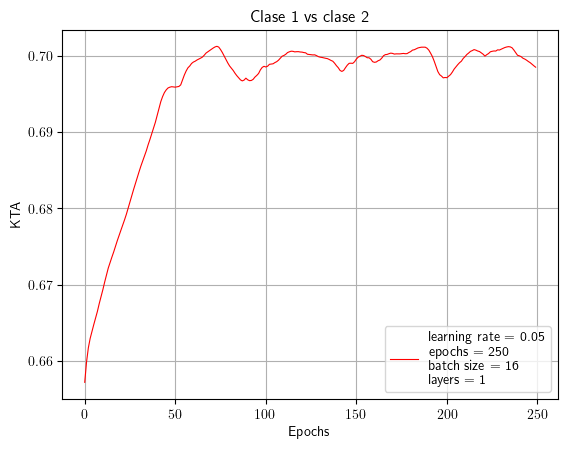
    


```python
svc_1Layer_12 = SVM_classifier(qubits, layers,opt_1Layer_12["params_opt"].detach(),
                               kernel_fn,X_train_12,X_test_12, Y_train_12,Y_test_12)
print(f'Optimization results:\n {opt_1Layer_12} \nSVC results: {svc_1Layer_12}')
```

    Optimization results:
     {'params_init': tensor([[-0.0395,  0.8329, -0.4755,  0.9155]], grad_fn=<CloneBackward0>), 'params_opt': tensor([[-0.1496, -0.1398, -1.2082, -0.8108]], requires_grad=True), 'latest_kta': tensor(0.6985, grad_fn=<DivBackward0>)} 
    SVC results: {'Clf': SVC(kernel=<function SVM_classifier.<locals>.<lambda> at 0x000001E6F3DC3380>), 'test_accuracy': 0.8666666666666667}
    

## Clase 2 vs 0


```python
opt_1Layer_20=optimization(learning_rate, epochs, batch_size,qubits,layers,
                           kernel_fn,params=create_params_k2(qubits=qubits, layers=layers),
                           X=X_train_20,Y=Y_train_20, plot_kta = True, title="Clase 2 vs clase 0")
```

    Layer(s) = 1 ---- Epochs = 10 ---- Train KTA = 0.48792326
    Layer(s) = 1 ---- Epochs = 20 ---- Train KTA = 0.50311041
    Layer(s) = 1 ---- Epochs = 30 ---- Train KTA = 0.50325727
    Layer(s) = 1 ---- Epochs = 40 ---- Train KTA = 0.50584137
    Layer(s) = 1 ---- Epochs = 50 ---- Train KTA = 0.50541461
    Layer(s) = 1 ---- Epochs = 60 ---- Train KTA = 0.50504786
    Layer(s) = 1 ---- Epochs = 70 ---- Train KTA = 0.50601679
    Layer(s) = 1 ---- Epochs = 80 ---- Train KTA = 0.50623709
    Layer(s) = 1 ---- Epochs = 90 ---- Train KTA = 0.50589901
    Layer(s) = 1 ---- Epochs = 100 ---- Train KTA = 0.50428331
    Layer(s) = 1 ---- Epochs = 110 ---- Train KTA = 0.50269145
    Layer(s) = 1 ---- Epochs = 120 ---- Train KTA = 0.50270915
    Layer(s) = 1 ---- Epochs = 130 ---- Train KTA = 0.50554794
    Layer(s) = 1 ---- Epochs = 140 ---- Train KTA = 0.50377363
    Layer(s) = 1 ---- Epochs = 150 ---- Train KTA = 0.50384474
    Layer(s) = 1 ---- Epochs = 160 ---- Train KTA = 0.50450009
    Layer(s) = 1 ---- Epochs = 170 ---- Train KTA = 0.50414997
    Layer(s) = 1 ---- Epochs = 180 ---- Train KTA = 0.50545025
    Layer(s) = 1 ---- Epochs = 190 ---- Train KTA = 0.50530463
    Layer(s) = 1 ---- Epochs = 200 ---- Train KTA = 0.50467712
    Layer(s) = 1 ---- Epochs = 210 ---- Train KTA = 0.50506002
    Layer(s) = 1 ---- Epochs = 220 ---- Train KTA = 0.50550550
    Layer(s) = 1 ---- Epochs = 230 ---- Train KTA = 0.50633514
    Layer(s) = 1 ---- Epochs = 240 ---- Train KTA = 0.50557369
    Layer(s) = 1 ---- Epochs = 250 ---- Train KTA = 0.50624788
    


    
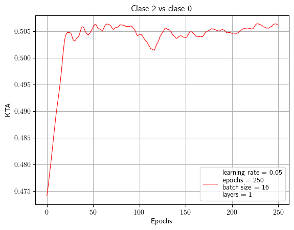
    


```python
svc_1Layer_20 = SVM_classifier(qubits, layers,opt_1Layer_12["params_opt"].detach(),
                               kernel_fn,X_train_20,X_test_20, Y_train_20,Y_test_20)
print(f'Optimization results:\n {opt_1Layer_20} \nSVC results: {svc_1Layer_20}')
```

    Optimization results:
     {'params_init': tensor([[-1.6821, -0.4186, -0.8033, -0.0119]], grad_fn=<CloneBackward0>), 'params_opt': tensor([[-1.6985, -0.1673, -1.2978,  0.9400]], requires_grad=True), 'latest_kta': tensor(0.5062, grad_fn=<DivBackward0>)} 
    SVC results: {'Clf': SVC(kernel=<function SVM_classifier.<locals>.<lambda> at 0x000001E771ABEDE0>), 'test_accuracy': 0.9666666666666667}
    

# 2 CAPAS


```python
%run -i create_iris_data.py
%run -i circuito_v2.py
%run -i multiclass_clf.py

qubits = 4
batch_size=16
epochs = 250
kernel_fn = kernel_v2
```

## Clase 0 vs clase 1


```python
layers = 2
learning_rate = 0.025
opt_2Layer_01=optimization(learning_rate, epochs, batch_size,qubits,layers,
                           kernel_fn,params=create_params_k2(qubits=qubits, layers=layers),
                           X=X_train_01,Y=Y_train_01, plot_kta = True, title="Clase 0 vs clase 1")
```

    Layer(s) = 2 ---- Epochs = 10 ---- Train KTA = 0.35112956
    Layer(s) = 2 ---- Epochs = 20 ---- Train KTA = 0.37654021
    Layer(s) = 2 ---- Epochs = 30 ---- Train KTA = 0.40265939
    Layer(s) = 2 ---- Epochs = 40 ---- Train KTA = 0.41201270
    Layer(s) = 2 ---- Epochs = 50 ---- Train KTA = 0.42526710
    Layer(s) = 2 ---- Epochs = 60 ---- Train KTA = 0.43108007
    Layer(s) = 2 ---- Epochs = 70 ---- Train KTA = 0.43837172
    Layer(s) = 2 ---- Epochs = 80 ---- Train KTA = 0.45385870
    Layer(s) = 2 ---- Epochs = 90 ---- Train KTA = 0.45924005
    Layer(s) = 2 ---- Epochs = 100 ---- Train KTA = 0.46510917
    Layer(s) = 2 ---- Epochs = 110 ---- Train KTA = 0.46798778
    Layer(s) = 2 ---- Epochs = 120 ---- Train KTA = 0.47075731
    Layer(s) = 2 ---- Epochs = 130 ---- Train KTA = 0.47227925
    Layer(s) = 2 ---- Epochs = 140 ---- Train KTA = 0.47489604
    Layer(s) = 2 ---- Epochs = 150 ---- Train KTA = 0.47779104
    Layer(s) = 2 ---- Epochs = 160 ---- Train KTA = 0.47928289
    Layer(s) = 2 ---- Epochs = 170 ---- Train KTA = 0.48014969
    Layer(s) = 2 ---- Epochs = 180 ---- Train KTA = 0.48041782
    Layer(s) = 2 ---- Epochs = 190 ---- Train KTA = 0.47983590
    Layer(s) = 2 ---- Epochs = 200 ---- Train KTA = 0.47903943
    Layer(s) = 2 ---- Epochs = 210 ---- Train KTA = 0.48946795
    Layer(s) = 2 ---- Epochs = 220 ---- Train KTA = 0.51386660
    Layer(s) = 2 ---- Epochs = 230 ---- Train KTA = 0.52369577
    Layer(s) = 2 ---- Epochs = 240 ---- Train KTA = 0.53584754
    Layer(s) = 2 ---- Epochs = 250 ---- Train KTA = 0.54944295
    


    
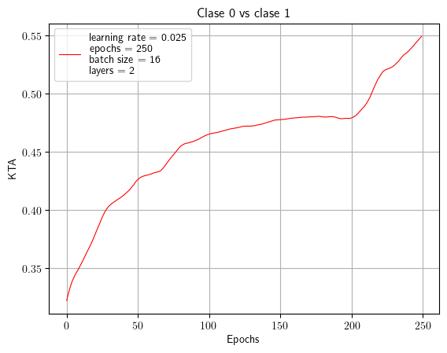
    


```python
opt_2Layer_01
```


    {'params_init': tensor([[-0.7449,  0.6665, -1.8984, -0.0996],
             [ 0.3862, -0.4291, -1.1559, -0.1346]], grad_fn=<CloneBackward0>),
     'params_opt': tensor([[-1.8356,  0.1275, -3.2358,  2.3315],
             [ 2.4469,  0.2466, -3.0476, -1.3541]], requires_grad=True),
     'latest_kta': tensor(0.5494, grad_fn=<DivBackward0>)}


## Clase 1 vs Clase 2


```python
learning_rate = 0.025
epochs = 250
layers = 2
opt_2Layer_12=optimization(learning_rate, epochs, batch_size,qubits,layers,
                           kernel_fn,params=create_params_k2( qubits=qubits, layers=layers),
                           X=X_train_12,Y=Y_train_12, plot_kta = True, title="Clase 1 vs clase 2, 2 capas")
```

    Layer(s) = 2 ---- Epochs = 10 ---- Train KTA = 0.64685220
    Layer(s) = 2 ---- Epochs = 20 ---- Train KTA = 0.67060131
    Layer(s) = 2 ---- Epochs = 30 ---- Train KTA = 0.70914555
    Layer(s) = 2 ---- Epochs = 40 ---- Train KTA = 0.78958076
    Layer(s) = 2 ---- Epochs = 50 ---- Train KTA = 0.82733744
    Layer(s) = 2 ---- Epochs = 60 ---- Train KTA = 0.83997750
    Layer(s) = 2 ---- Epochs = 70 ---- Train KTA = 0.83949143
    Layer(s) = 2 ---- Epochs = 80 ---- Train KTA = 0.84205425
    Layer(s) = 2 ---- Epochs = 90 ---- Train KTA = 0.84474796
    Layer(s) = 2 ---- Epochs = 100 ---- Train KTA = 0.84207171
    Layer(s) = 2 ---- Epochs = 110 ---- Train KTA = 0.84127504
    Layer(s) = 2 ---- Epochs = 120 ---- Train KTA = 0.84560096
    Layer(s) = 2 ---- Epochs = 130 ---- Train KTA = 0.84578902
    Layer(s) = 2 ---- Epochs = 140 ---- Train KTA = 0.84657472
    Layer(s) = 2 ---- Epochs = 150 ---- Train KTA = 0.84421903
    Layer(s) = 2 ---- Epochs = 160 ---- Train KTA = 0.84824961
    Layer(s) = 2 ---- Epochs = 170 ---- Train KTA = 0.84963989
    Layer(s) = 2 ---- Epochs = 180 ---- Train KTA = 0.85093516
    Layer(s) = 2 ---- Epochs = 190 ---- Train KTA = 0.85026968
    Layer(s) = 2 ---- Epochs = 200 ---- Train KTA = 0.85128987
    Layer(s) = 2 ---- Epochs = 210 ---- Train KTA = 0.85074693
    Layer(s) = 2 ---- Epochs = 220 ---- Train KTA = 0.85071570
    Layer(s) = 2 ---- Epochs = 230 ---- Train KTA = 0.85006058
    Layer(s) = 2 ---- Epochs = 240 ---- Train KTA = 0.84927648
    Layer(s) = 2 ---- Epochs = 250 ---- Train KTA = 0.84992802
    


    
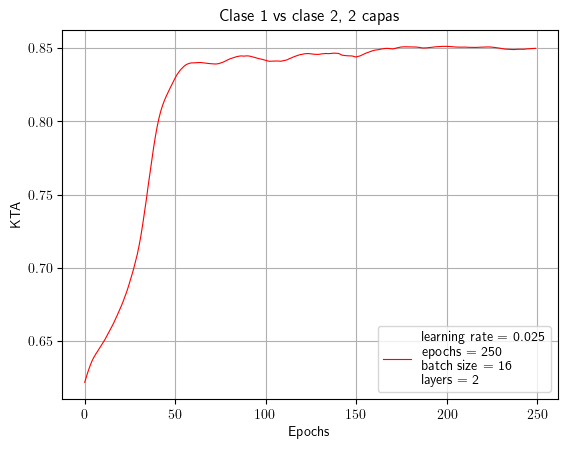
    


```python
opt_2Layer_12
```


    {'params_init': tensor([[-2.1255,  1.4088,  0.3475, -1.1803],
             [-0.5033,  0.4598, -1.3524, -0.2626]], grad_fn=<CloneBackward0>),
     'params_opt': tensor([[-1.8932,  2.3739,  1.7020, -2.0017],
             [-0.4359,  0.3168,  0.7401, -0.3023]], requires_grad=True),
     'latest_kta': tensor(0.8499, grad_fn=<DivBackward0>)}


## Clase 2 vs clase 0


```python
learning_rate = 0.02
epochs = 250
opt_2Layer_20=optimization(learning_rate, epochs, batch_size,qubits,layers,
                           kernel_fn,params=create_params_k2( qubits=qubits, layers=layers),
                           X=X_train_20,Y=Y_train_20, plot_kta = True, title="Clase 2 vs clase 0, 2 capas")
```

    Layer(s) = 2 ---- Epochs = 10 ---- Train KTA = 0.35303769
    Layer(s) = 2 ---- Epochs = 20 ---- Train KTA = 0.39265436
    Layer(s) = 2 ---- Epochs = 30 ---- Train KTA = 0.42398301
    Layer(s) = 2 ---- Epochs = 40 ---- Train KTA = 0.44477612
    Layer(s) = 2 ---- Epochs = 50 ---- Train KTA = 0.45288292
    Layer(s) = 2 ---- Epochs = 60 ---- Train KTA = 0.45860815
    Layer(s) = 2 ---- Epochs = 70 ---- Train KTA = 0.46290538
    Layer(s) = 2 ---- Epochs = 80 ---- Train KTA = 0.46966183
    Layer(s) = 2 ---- Epochs = 90 ---- Train KTA = 0.47200900
    Layer(s) = 2 ---- Epochs = 100 ---- Train KTA = 0.47502643
    Layer(s) = 2 ---- Epochs = 110 ---- Train KTA = 0.47601128
    Layer(s) = 2 ---- Epochs = 120 ---- Train KTA = 0.47624326
    Layer(s) = 2 ---- Epochs = 130 ---- Train KTA = 0.47559443
    Layer(s) = 2 ---- Epochs = 140 ---- Train KTA = 0.47520456
    Layer(s) = 2 ---- Epochs = 150 ---- Train KTA = 0.47319508
    Layer(s) = 2 ---- Epochs = 160 ---- Train KTA = 0.47149450
    Layer(s) = 2 ---- Epochs = 170 ---- Train KTA = 0.47368914
    Layer(s) = 2 ---- Epochs = 180 ---- Train KTA = 0.47336304
    Layer(s) = 2 ---- Epochs = 190 ---- Train KTA = 0.47311521
    Layer(s) = 2 ---- Epochs = 200 ---- Train KTA = 0.47049734
    Layer(s) = 2 ---- Epochs = 210 ---- Train KTA = 0.47553369
    Layer(s) = 2 ---- Epochs = 220 ---- Train KTA = 0.47397286
    Layer(s) = 2 ---- Epochs = 230 ---- Train KTA = 0.47417530
    Layer(s) = 2 ---- Epochs = 240 ---- Train KTA = 0.47571591
    Layer(s) = 2 ---- Epochs = 250 ---- Train KTA = 0.47283545
    


    
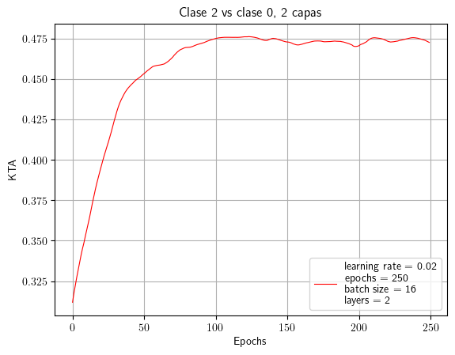
    


```python
opt_2Layer_20
```


    {'params_init': tensor([[-1.3225, -0.9520, -1.4014, -0.4181],
             [-0.9924, -1.9152, -0.1498, -0.1744]], grad_fn=<CloneBackward0>),
     'params_opt': tensor([[-2.3540, -0.3696, -0.6999, -0.3996],
             [-1.2611, -1.1652, -0.6331, -0.8964]], requires_grad=True),
     'latest_kta': tensor(0.4728, grad_fn=<DivBackward0>)}


# 3 CAPAS

## Clase 0 vs clase 1


```python
learning_rate = 0.03
layers = 3
epochs = 220
opt_3Layer_01=optimization(learning_rate, epochs, batch_size,qubits,layers,
                           kernel_fn,params=create_params_k2(qubits=qubits, layers=layers),
                           X=X_train_01,Y=Y_train_01, plot_kta = True, title="Clase 0 vs clase 1, 3 Capas")
```

    Layer(s) = 3 ---- Epochs = 10 ---- Train KTA = 0.36158702
    Layer(s) = 3 ---- Epochs = 20 ---- Train KTA = 0.39395845
    Layer(s) = 3 ---- Epochs = 30 ---- Train KTA = 0.43592331
    Layer(s) = 3 ---- Epochs = 40 ---- Train KTA = 0.47465128
    Layer(s) = 3 ---- Epochs = 50 ---- Train KTA = 0.50194407
    Layer(s) = 3 ---- Epochs = 60 ---- Train KTA = 0.52196407
    Layer(s) = 3 ---- Epochs = 70 ---- Train KTA = 0.54820770
    Layer(s) = 3 ---- Epochs = 80 ---- Train KTA = 0.57769108
    Layer(s) = 3 ---- Epochs = 90 ---- Train KTA = 0.60116619
    Layer(s) = 3 ---- Epochs = 100 ---- Train KTA = 0.61346555
    Layer(s) = 3 ---- Epochs = 110 ---- Train KTA = 0.61875826
    Layer(s) = 3 ---- Epochs = 120 ---- Train KTA = 0.62478578
    Layer(s) = 3 ---- Epochs = 130 ---- Train KTA = 0.63320458
    Layer(s) = 3 ---- Epochs = 140 ---- Train KTA = 0.63459027
    Layer(s) = 3 ---- Epochs = 150 ---- Train KTA = 0.63599235
    Layer(s) = 3 ---- Epochs = 160 ---- Train KTA = 0.63409972
    Layer(s) = 3 ---- Epochs = 170 ---- Train KTA = 0.64064127
    Layer(s) = 3 ---- Epochs = 180 ---- Train KTA = 0.64518982
    Layer(s) = 3 ---- Epochs = 190 ---- Train KTA = 0.64841455
    Layer(s) = 3 ---- Epochs = 200 ---- Train KTA = 0.64949673
    Layer(s) = 3 ---- Epochs = 210 ---- Train KTA = 0.65455598
    Layer(s) = 3 ---- Epochs = 220 ---- Train KTA = 0.65135956
    


    
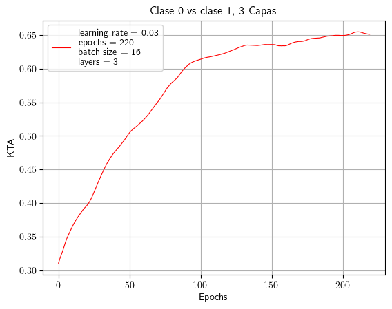
    


```python
opt_3Layer_01
```


    {'params_init': tensor([[ 1.6077,  0.8810, -0.9711,  0.8261],
             [ 1.0641,  2.7952, -0.0775, -0.7910],
             [-0.7874, -0.6846,  1.9046, -0.0284]], grad_fn=<CloneBackward0>),
     'params_opt': tensor([[ 2.9623, -0.2286, -1.3422,  2.3956],
             [ 3.0711,  2.9154, -0.0306, -2.1503],
             [-1.7235, -1.9817,  0.1852,  0.0263]], requires_grad=True),
     'latest_kta': tensor(0.6514, grad_fn=<DivBackward0>)}


## Clase 1 vs Clase 2


```python
epochs = 250
learning_rate = 0.03
opt_3Layer_12=optimization(learning_rate, epochs, batch_size,qubits,layers,
                           kernel_fn,params=create_params_k2(qubits=qubits, layers=layers),
                           X=X_train_12,Y=Y_train_12, plot_kta = True, title="Clase 1 vs clase 2, 3 Capas")
```

    Layer(s) = 3 ---- Epochs = 10 ---- Train KTA = 0.59164202
    Layer(s) = 3 ---- Epochs = 20 ---- Train KTA = 0.62590325
    Layer(s) = 3 ---- Epochs = 30 ---- Train KTA = 0.64987236
    Layer(s) = 3 ---- Epochs = 40 ---- Train KTA = 0.66953474
    Layer(s) = 3 ---- Epochs = 50 ---- Train KTA = 0.68897158
    Layer(s) = 3 ---- Epochs = 60 ---- Train KTA = 0.69185704
    Layer(s) = 3 ---- Epochs = 70 ---- Train KTA = 0.70390272
    Layer(s) = 3 ---- Epochs = 80 ---- Train KTA = 0.70464861
    Layer(s) = 3 ---- Epochs = 90 ---- Train KTA = 0.70335644
    Layer(s) = 3 ---- Epochs = 100 ---- Train KTA = 0.70788014
    Layer(s) = 3 ---- Epochs = 110 ---- Train KTA = 0.69979757
    Layer(s) = 3 ---- Epochs = 120 ---- Train KTA = 0.71075082
    Layer(s) = 3 ---- Epochs = 130 ---- Train KTA = 0.70568311
    Layer(s) = 3 ---- Epochs = 140 ---- Train KTA = 0.70898831
    Layer(s) = 3 ---- Epochs = 150 ---- Train KTA = 0.70560086
    Layer(s) = 3 ---- Epochs = 160 ---- Train KTA = 0.70997244
    Layer(s) = 3 ---- Epochs = 170 ---- Train KTA = 0.70155758
    Layer(s) = 3 ---- Epochs = 180 ---- Train KTA = 0.70897901
    Layer(s) = 3 ---- Epochs = 190 ---- Train KTA = 0.71026862
    Layer(s) = 3 ---- Epochs = 200 ---- Train KTA = 0.70811206
    Layer(s) = 3 ---- Epochs = 210 ---- Train KTA = 0.70774889
    Layer(s) = 3 ---- Epochs = 220 ---- Train KTA = 0.70466423
    Layer(s) = 3 ---- Epochs = 230 ---- Train KTA = 0.70761597
    Layer(s) = 3 ---- Epochs = 240 ---- Train KTA = 0.70689929
    Layer(s) = 3 ---- Epochs = 250 ---- Train KTA = 0.71001667
    


    
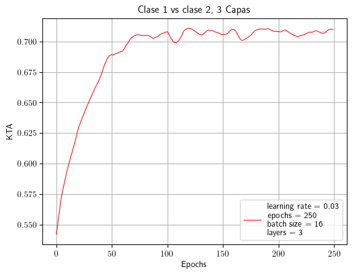
    


```python
opt_3Layer_12
```


    {'params_init': tensor([[-0.8710,  1.3020, -0.6489, -1.5632],
             [ 2.2289,  2.0192,  0.2269, -0.1506],
             [-0.0627,  0.3628, -1.1832, -0.6052]], grad_fn=<CloneBackward0>),
     'params_opt': tensor([[-1.4025,  0.7426, -1.2352, -1.7183],
             [ 2.5227,  2.1812,  0.5861, -0.9121],
             [ 0.0653, -0.1261, -0.2155, -0.7657]], requires_grad=True),
     'latest_kta': tensor(0.7100, grad_fn=<DivBackward0>)}


## Clase 2 vs Clase 0


```python
opt_3Layer_20=optimization(learning_rate, epochs, batch_size,qubits,layers,
                           kernel_fn,params=create_params_k2(qubits=qubits, layers=layers),
                           X=X_train_20,Y=Y_train_20, plot_kta = True, title="Clase 2 vs clase 0, 3 Capas")
```

    Layer(s) = 3 ---- Epochs = 10 ---- Train KTA = 0.33057541
    Layer(s) = 3 ---- Epochs = 20 ---- Train KTA = 0.36079663
    Layer(s) = 3 ---- Epochs = 30 ---- Train KTA = 0.40324363
    Layer(s) = 3 ---- Epochs = 40 ---- Train KTA = 0.40678051
    Layer(s) = 3 ---- Epochs = 50 ---- Train KTA = 0.41406393
    Layer(s) = 3 ---- Epochs = 60 ---- Train KTA = 0.42038774
    Layer(s) = 3 ---- Epochs = 70 ---- Train KTA = 0.42202142
    Layer(s) = 3 ---- Epochs = 80 ---- Train KTA = 0.42352447
    Layer(s) = 3 ---- Epochs = 90 ---- Train KTA = 0.42940241
    Layer(s) = 3 ---- Epochs = 100 ---- Train KTA = 0.41698191
    Layer(s) = 3 ---- Epochs = 110 ---- Train KTA = 0.42324290
    Layer(s) = 3 ---- Epochs = 120 ---- Train KTA = 0.41871169
    Layer(s) = 3 ---- Epochs = 130 ---- Train KTA = 0.42390737
    Layer(s) = 3 ---- Epochs = 140 ---- Train KTA = 0.42776760
    Layer(s) = 3 ---- Epochs = 150 ---- Train KTA = 0.43409809
    Layer(s) = 3 ---- Epochs = 160 ---- Train KTA = 0.43727008
    Layer(s) = 3 ---- Epochs = 170 ---- Train KTA = 0.44171339
    Layer(s) = 3 ---- Epochs = 180 ---- Train KTA = 0.46019375
    Layer(s) = 3 ---- Epochs = 190 ---- Train KTA = 0.46158195
    Layer(s) = 3 ---- Epochs = 200 ---- Train KTA = 0.46624270
    Layer(s) = 3 ---- Epochs = 210 ---- Train KTA = 0.48795253
    Layer(s) = 3 ---- Epochs = 220 ---- Train KTA = 0.50406921
    


    
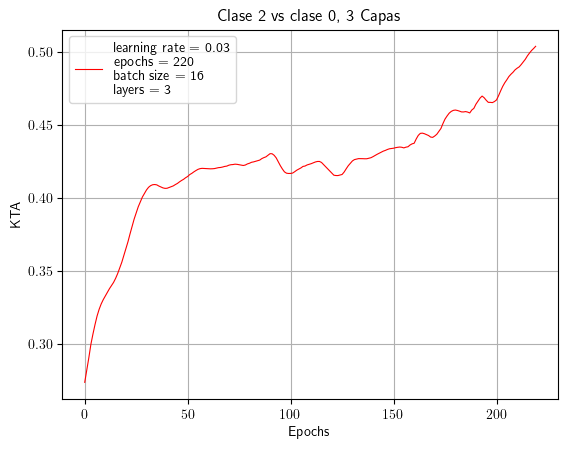
    


```python
opt_3Layer_20
```


    {'params_init': tensor([[ 1.3391,  1.6860, -2.3327, -0.9512],
             [-0.4108, -0.5059, -1.3975,  0.4182],
             [-2.8163, -0.4103,  1.8277, -1.4816]], grad_fn=<CloneBackward0>),
     'params_opt': tensor([[ 2.0612,  1.9870, -1.5497, -2.2230],
             [-0.3397,  0.0154, -1.3658,  0.2703],
             [-2.8656, -0.8892,  1.6216,  0.1945]], requires_grad=True),
     'latest_kta': tensor(0.5041, grad_fn=<DivBackward0>)}


# 4 CAPAS

## Capa 0 vs Capa 1


```python
learning_rate = 0.03
layers = 4
epochs = 250
opt_4Layer_01=optimization(learning_rate, epochs, batch_size,qubits,layers,
                           kernel_fn,params=create_params_k2(qubits=qubits, layers=layers),
                           X=X_train_01,Y=Y_train_01, plot_kta = True, title="Clase 0 vs clase 1, 4 Capas")
```

    Layer(s) = 4 ---- Epochs = 10 ---- Train KTA = 0.31301469
    Layer(s) = 4 ---- Epochs = 20 ---- Train KTA = 0.32483625
    Layer(s) = 4 ---- Epochs = 30 ---- Train KTA = 0.32676765
    Layer(s) = 4 ---- Epochs = 40 ---- Train KTA = 0.33445728
    Layer(s) = 4 ---- Epochs = 50 ---- Train KTA = 0.33668351
    Layer(s) = 4 ---- Epochs = 60 ---- Train KTA = 0.33850527
    Layer(s) = 4 ---- Epochs = 70 ---- Train KTA = 0.34031418
    Layer(s) = 4 ---- Epochs = 80 ---- Train KTA = 0.35251796
    Layer(s) = 4 ---- Epochs = 90 ---- Train KTA = 0.35593140
    Layer(s) = 4 ---- Epochs = 100 ---- Train KTA = 0.36424890
    Layer(s) = 4 ---- Epochs = 110 ---- Train KTA = 0.36948040
    Layer(s) = 4 ---- Epochs = 120 ---- Train KTA = 0.36950707
    Layer(s) = 4 ---- Epochs = 130 ---- Train KTA = 0.36517239
    Layer(s) = 4 ---- Epochs = 140 ---- Train KTA = 0.37451935
    Layer(s) = 4 ---- Epochs = 150 ---- Train KTA = 0.37596616
    Layer(s) = 4 ---- Epochs = 160 ---- Train KTA = 0.37618539
    Layer(s) = 4 ---- Epochs = 170 ---- Train KTA = 0.37872219
    Layer(s) = 4 ---- Epochs = 180 ---- Train KTA = 0.37732676
    Layer(s) = 4 ---- Epochs = 190 ---- Train KTA = 0.38809916
    Layer(s) = 4 ---- Epochs = 200 ---- Train KTA = 0.39156571
    Layer(s) = 4 ---- Epochs = 210 ---- Train KTA = 0.38814324
    Layer(s) = 4 ---- Epochs = 220 ---- Train KTA = 0.38892820
    Layer(s) = 4 ---- Epochs = 230 ---- Train KTA = 0.38966101
    Layer(s) = 4 ---- Epochs = 240 ---- Train KTA = 0.39017457
    Layer(s) = 4 ---- Epochs = 250 ---- Train KTA = 0.39726648
    


    
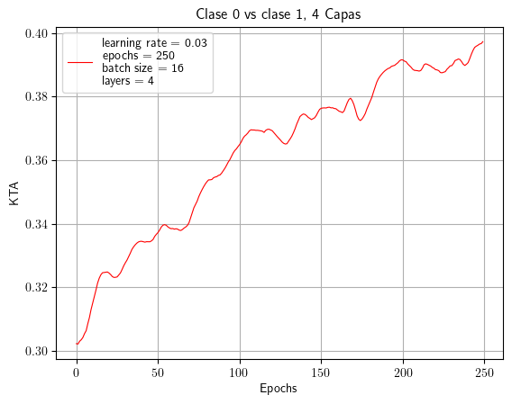
    


```python
opt_4Layer_01
```


    {'params_init': tensor([[ 1.4575,  0.0757, -0.4907,  0.4617],
             [ 0.1659,  0.4788,  0.1844,  0.1117],
             [-1.2084, -0.3314,  1.4607,  1.9163],
             [-0.2682,  0.5578, -0.5750,  0.5440]], grad_fn=<CloneBackward0>),
     'params_opt': tensor([[ 1.6127, -0.5819, -0.5743,  0.9243],
             [-0.1322,  0.3557,  1.5869,  0.2718],
             [-1.8247, -0.3342,  2.0580,  3.3858],
             [-0.0888,  1.5733, -0.2166, -0.5001]], requires_grad=True),
     'latest_kta': tensor(0.3973, grad_fn=<DivBackward0>)}


## Capa 1 vs Capa 2


```python
layers = 4
epochs = 250
opt_4Layer_12=optimization(learning_rate, epochs, batch_size,qubits,layers,
                           kernel_fn,params=create_params_k2(qubits=qubits, layers=layers),
                           X=X_train_12,Y=Y_train_12, plot_kta = True, title="Clase 1 vs clase 2, 4 Capas")
```

    Layer(s) = 4 ---- Epochs = 10 ---- Train KTA = 0.51156265
    Layer(s) = 4 ---- Epochs = 20 ---- Train KTA = 0.52797347
    Layer(s) = 4 ---- Epochs = 30 ---- Train KTA = 0.52061635
    Layer(s) = 4 ---- Epochs = 40 ---- Train KTA = 0.52477258
    Layer(s) = 4 ---- Epochs = 50 ---- Train KTA = 0.53714877
    Layer(s) = 4 ---- Epochs = 60 ---- Train KTA = 0.54961157
    Layer(s) = 4 ---- Epochs = 70 ---- Train KTA = 0.55939507
    Layer(s) = 4 ---- Epochs = 80 ---- Train KTA = 0.57408738
    Layer(s) = 4 ---- Epochs = 90 ---- Train KTA = 0.58073217
    Layer(s) = 4 ---- Epochs = 100 ---- Train KTA = 0.58918417
    Layer(s) = 4 ---- Epochs = 110 ---- Train KTA = 0.58717090
    Layer(s) = 4 ---- Epochs = 120 ---- Train KTA = 0.59852386
    Layer(s) = 4 ---- Epochs = 130 ---- Train KTA = 0.61119246
    Layer(s) = 4 ---- Epochs = 140 ---- Train KTA = 0.62219012
    Layer(s) = 4 ---- Epochs = 150 ---- Train KTA = 0.63359302
    Layer(s) = 4 ---- Epochs = 160 ---- Train KTA = 0.64517158
    Layer(s) = 4 ---- Epochs = 170 ---- Train KTA = 0.65611416
    Layer(s) = 4 ---- Epochs = 180 ---- Train KTA = 0.65992278
    Layer(s) = 4 ---- Epochs = 190 ---- Train KTA = 0.66223085
    Layer(s) = 4 ---- Epochs = 200 ---- Train KTA = 0.66313577
    Layer(s) = 4 ---- Epochs = 210 ---- Train KTA = 0.66398168
    Layer(s) = 4 ---- Epochs = 220 ---- Train KTA = 0.66412407
    Layer(s) = 4 ---- Epochs = 230 ---- Train KTA = 0.66618437
    Layer(s) = 4 ---- Epochs = 240 ---- Train KTA = 0.66605729
    Layer(s) = 4 ---- Epochs = 250 ---- Train KTA = 0.66472340
    


    
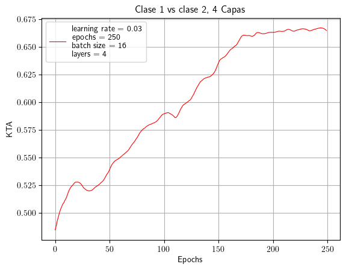
    


```python
opt_4Layer_12
```


    {'params_init': tensor([[-0.0426, -0.5444,  1.1851,  0.7141],
             [-2.0560,  1.0545, -0.7429, -0.3587],
             [ 1.8143, -2.4927,  1.2987,  0.3498],
             [ 0.2397, -0.3497,  0.4492,  1.9901]], grad_fn=<CloneBackward0>),
     'params_opt': tensor([[-1.8875, -1.8171,  1.0721,  0.0945],
             [-2.7552,  1.1530, -0.6033,  0.0553],
             [ 2.1404, -2.6744,  2.0857,  0.1950],
             [ 0.1954, -0.2516, -0.8069,  0.0248]], requires_grad=True),
     'latest_kta': tensor(0.6647, grad_fn=<DivBackward0>)}


## Capa 2 vs Capa 0


```python
opt_4Layer_20=optimization(learning_rate, epochs, batch_size,qubits,layers,
                           kernel_fn,params=create_params_k2(qubits=qubits, layers=layers),
                           X=X_train_20,Y=Y_train_20, plot_kta = True, title="Clase 2 vs clase 0, 4 Capas")
```

    Layer(s) = 4 ---- Epochs = 10 ---- Train KTA = 0.24485342
    Layer(s) = 4 ---- Epochs = 20 ---- Train KTA = 0.25789350
    Layer(s) = 4 ---- Epochs = 30 ---- Train KTA = 0.26065719
    Layer(s) = 4 ---- Epochs = 40 ---- Train KTA = 0.27320427
    Layer(s) = 4 ---- Epochs = 50 ---- Train KTA = 0.29747546
    Layer(s) = 4 ---- Epochs = 60 ---- Train KTA = 0.32341263
    Layer(s) = 4 ---- Epochs = 70 ---- Train KTA = 0.35581025
    Layer(s) = 4 ---- Epochs = 80 ---- Train KTA = 0.38235873
    Layer(s) = 4 ---- Epochs = 90 ---- Train KTA = 0.38925803
    Layer(s) = 4 ---- Epochs = 100 ---- Train KTA = 0.39391208
    Layer(s) = 4 ---- Epochs = 110 ---- Train KTA = 0.39943773
    Layer(s) = 4 ---- Epochs = 120 ---- Train KTA = 0.40807697
    Layer(s) = 4 ---- Epochs = 130 ---- Train KTA = 0.41698858
    Layer(s) = 4 ---- Epochs = 140 ---- Train KTA = 0.42749020
    Layer(s) = 4 ---- Epochs = 150 ---- Train KTA = 0.44027442
    Layer(s) = 4 ---- Epochs = 160 ---- Train KTA = 0.44698027
    Layer(s) = 4 ---- Epochs = 170 ---- Train KTA = 0.45892781
    Layer(s) = 4 ---- Epochs = 180 ---- Train KTA = 0.46510372
    Layer(s) = 4 ---- Epochs = 190 ---- Train KTA = 0.46650964
    Layer(s) = 4 ---- Epochs = 200 ---- Train KTA = 0.45129478
    Layer(s) = 4 ---- Epochs = 210 ---- Train KTA = 0.45858446
    Layer(s) = 4 ---- Epochs = 220 ---- Train KTA = 0.47268462
    Layer(s) = 4 ---- Epochs = 230 ---- Train KTA = 0.47504300
    Layer(s) = 4 ---- Epochs = 240 ---- Train KTA = 0.47936812
    Layer(s) = 4 ---- Epochs = 250 ---- Train KTA = 0.47252131
    


    
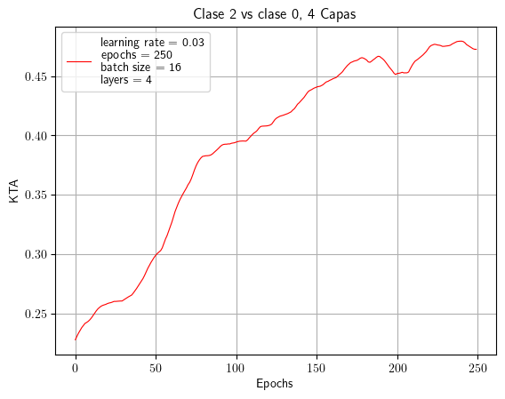
    


```python
opt_4Layer_20
```


    {'params_init': tensor([[ 1.0827, -1.8464,  1.7528,  0.3651],
             [-0.3542,  1.3647,  0.8197, -0.2380],
             [ 0.3512, -0.2736, -0.4275,  0.8600],
             [ 2.6366, -0.9470, -1.5795, -0.2424]], grad_fn=<CloneBackward0>),
     'params_opt': tensor([[ 0.0321, -2.9655,  2.1133,  1.2895],
             [-0.0715,  2.5225,  0.1952, -0.8970],
             [ 0.4744, -0.0593, -0.4529,  1.7432],
             [ 3.5083, -1.3877, -1.9547, -0.7768]], requires_grad=True),
     'latest_kta': tensor(0.4725, grad_fn=<DivBackward0>)}


```python

```
